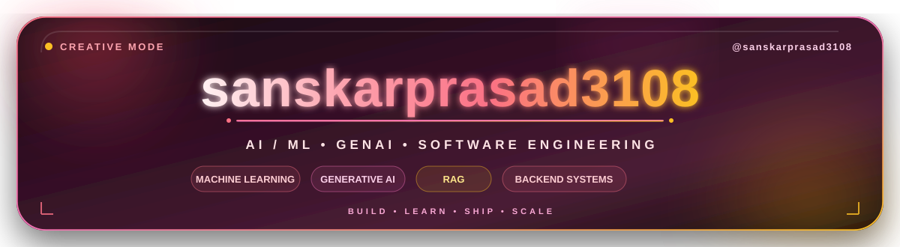
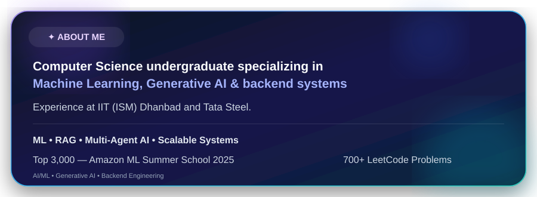

  

  
> 
Hi, I'm **sanskarprasad**. 

  

## Skills
Selected stack and skill badges will be generated from the GitHub profile and README strategy.

  <picture>
    <source media="(prefers-color-scheme: light)" srcset="https://www.gitskins.com/api/section/stack?username=sanskarprasad3108&theme=github-dark&mode=light" />
    
  </picture>

## GitHub Stats
GitSkins stat widgets will use the **GitHub** theme.

  <picture>
    <source media="(prefers-color-scheme: light)" srcset="https://www.gitskins.com/api/section/stats?username=sanskarprasad3108&theme=github-dark&mode=light" />
    
  </picture>

## Projects
Highlights repositories as proof of work.

  <picture>
    <source media="(prefers-color-scheme: light)" srcset="https://www.gitskins.com/api/section/projects?username=sanskarprasad3108&theme=github-dark&mode=light" />
    
  </picture>

## Connect
Contact and social links will appear here.

  <picture>
    <source media="(prefers-color-scheme: light)" srcset="https://www.gitskins.com/api/section/social?username=sanskarprasad3108&theme=github-dark&mode=light" />
    
  </picture>

<!-- Sections: Header, About Me, Skills, GitHub Stats, Projects, Connect -->
